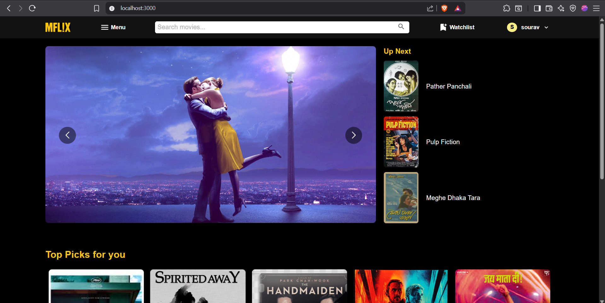

# 🎬 MFL!X – Movie Explorer & Review Platform

MFL!X is a full-stack movie exploration and review platform developed as a 2-1 Database Term Project. It combines a sleek React frontend with a robust Node.js backend and PostgreSQL database to deliver a rich, feature-packed user experience.

---

## 🔥 Features

### 🎥 Movie Discovery
- Explore lots of movies
- Watch trailers of the movies
- View details like genre, release date, overview, and cast

### ⭐ Rating & Reviewing
- Rate movies on a 10-star scale
- Leave detailed reviews for movies
- Rate cast performances individually
- Update or delete any review 

### 🧠 Smart Search
- Search movies by name
- Use advanced filters (genre, year, rating, etc.)
- View "Top Picks For You" personalized section
- Discover similar movies by genre and user behavior

### 📈 Trending Insights
- Browse top-rated, popular, and upcoming movies
- Discover what's hot right now

### 🔐 Authentication
- Sign up and log in with OTP verification via **EmailJS**
- Secure session handling
- Id deactivation and reactivation facility
- Password change option

### 🎬 Watchlist Management
- Add movies to your personal watchlist
- Remove movies with a single click

### 💬 Community Interaction
- React to other users’ reviews (like/dislike)
- Report inappropriate reviews to admins
- Delete or edit reviews

### 🛡️ Admin Panel
- View and moderate reported reviews
- Delete comments violating guidelines
- Temporarily ban users (1–365 days)
- Choose to ignore false reports
- See Top Users – ranked by engagement (ratings, reviews, reactions)
- Add movies to database

---

## 🛠️ Tech Stack

- **Frontend**: React.js, Material-UI
- **Backend**: Node.js, Express.js
- **Database**: PostgreSQL
- **Email OTP**: EmailJS
- **Auth**: JWT-based authentication

---

## 📸 Screenshots

---

.png)

